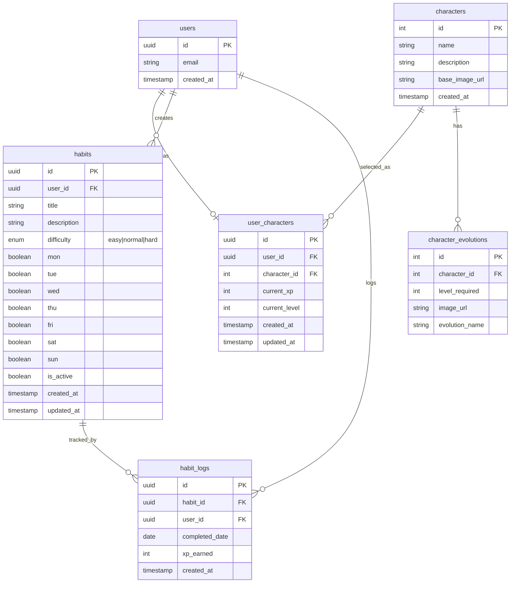

# 🗄️ 데이터베이스 스키마 설계

## ERD (Entity Relationship Diagram)



---

## 테이블 상세

### 1. `characters` - 캐릭터 마스터 테이블

| 컬럼 | 타입 | 설명 |
|------|------|------|
| id | SERIAL | Primary Key |
| name | VARCHAR(50) | 캐릭터 이름 (예: "푸딩이", "코코", "모찌") |
| description | TEXT | 캐릭터 소개 |
| base_image_url | VARCHAR(255) | 기본 이미지 URL |
| created_at | TIMESTAMPTZ | 생성일시 |

### 2. `character_evolutions` - 캐릭터 진화 단계

| 컬럼 | 타입 | 설명 |
|------|------|------|
| id | SERIAL | Primary Key |
| character_id | INT | FK → characters.id |
| level_required | INT | 해당 외형에 필요한 레벨 |
| image_url | VARCHAR(255) | 진화 단계 이미지 URL |
| evolution_name | VARCHAR(50) | 진화 단계 이름 (예: "아기 푸딩이") |

### 3. `user_characters` - 사용자가 선택한 캐릭터

| 컬럼 | 타입 | 설명 |
|------|------|------|
| id | UUID | Primary Key |
| user_id | UUID | FK → auth.users.id |
| character_id | INT | FK → characters.id |
| current_xp | INT | 현재 누적 경험치 |
| current_level | INT | 현재 레벨 |
| created_at | TIMESTAMPTZ | 생성일시 |
| updated_at | TIMESTAMPTZ | 수정일시 |

### 4. `habits` - 습관 테이블

| 컬럼 | 타입 | 설명 |
|------|------|------|
| id | UUID | Primary Key |
| user_id | UUID | FK → auth.users.id |
| title | VARCHAR(100) | 습관 제목 |
| description | TEXT | 습관 설명 |
| difficulty | ENUM | 'easy' / 'normal' / 'hard' |
| mon ~ sun | BOOLEAN | 각 요일 활성화 여부 |
| is_active | BOOLEAN | 습관 활성화 상태 |
| created_at | TIMESTAMPTZ | 생성일시 |
| updated_at | TIMESTAMPTZ | 수정일시 |

### 5. `habit_logs` - 습관 완료 기록

| 컬럼 | 타입 | 설명 |
|------|------|------|
| id | UUID | Primary Key |
| habit_id | UUID | FK → habits.id |
| user_id | UUID | FK → auth.users.id |
| completed_date | DATE | 완료 날짜 |
| xp_earned | INT | 획득한 경험치 |
| created_at | TIMESTAMPTZ | 생성일시 |

---

## 경험치 & 레벨 시스템

### 난이도별 경험치

| 난이도 | 경험치 |
|--------|--------|
| 쉬움 (easy) | 10 XP |
| 보통 (normal) | 20 XP |
| 어려움 (hard) | 35 XP |

### 레벨업 공식

```
필요 경험치 = Level × 100
```

예시:
- Lv 1 → Lv 2: 100 XP
- Lv 2 → Lv 3: 200 XP
- Lv 5 → Lv 6: 500 XP

### 진화 레벨 (예시)

| 레벨 | 상태 |
|------|------|
| 1-4 | 1단계 (아기) |
| 5-9 | 2단계 (성장) |
| 10+ | 3단계 (완성) |
